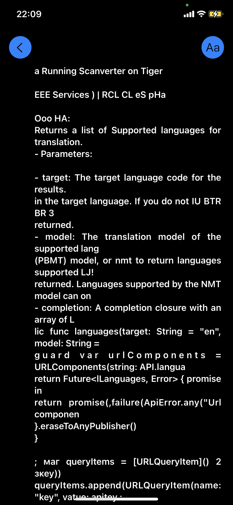

## ScanverterApp

* captures photos (vision kit vs plain camera as service) 
* converts them to pdf (and also saves them as images in photo library) 
* text recognition with tesseract (vision kit's one disabled)
* SwiftUI with Combine
* SwiftyTesseract, ExyteGrid
* MVVM architecture for presentation layer
* SOA for business logic
* translation (google) service disabled
* not finished yet
* iOS 14

### Screenshots
<table>
  	<tr>
  		<td></td>
		<td></td>
		<td></td>
		<td></td>
	</tr>
	<tr>
		<td></td>
		<td></td>
		<td><td>
		<td><td>
	</tr>
	<tr>
		<td><td>
		<td><td>
		<td><td>
	</tr>
</table>